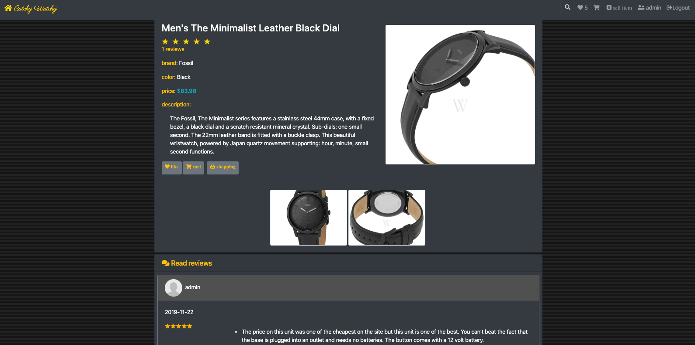

# my portfolio 
### This is my portfolio project, build with JavaScript, HTML and CSS. The base HTML template downloaded from [HTML5 UP](https://html5up.net/) and I used multiple JavaScript libraries such as JQuery, Animate On Scroll, fancybox and [JavaScript Email Library](https://postmail.invotes.com).
## [live link](http://stackoverflow.com)

## Code Snippets
### HTML
```html
  <a href="images/work/catchy.gif" class="image" data-fancybox="gallery">
    <picture>
      <source srcset="images/work/catchy_preview-min.webp" type="image/webp">
      <source srcset="images/work/catchy_preview-min.png" type="image/jpeg"> 
      
    </picture>
  </a>
```
### JavaScript

```javascript
var code;
function createCaptcha() {
  //clear the contents of captcha div first 
  document.getElementById('captcha').innerHTML = "";
  // var charsArray = "0123456789abcdefghijklmnopqrstuvwxyzABCDEFGHIJKLMNOPQRSTUVWXYZ@!#$%^&*";
  var charsArray = "0123456789";
  var lengthOtp = 4;
  var captcha = [];
  for (var i = 0; i < lengthOtp; i++) {
    //below code will not allow Repetition of Characters
    var index = Math.floor(Math.random() * charsArray.length + 1); //get the next character from the array
    if (captcha.indexOf(charsArray[index]) == -1)
      captcha.push(charsArray[index]);
    else i--;
  }
  var canv = document.createElement("canvas");
  canv.id = "captcha";
  canv.width = 100;
  canv.height = 50;
  var ctx = canv.getContext("2d");
  ctx.font = "25px Georgia";
  ctx.strokeText(captcha.join(""), 0, 30);
  //storing captcha so that can validate you can save it somewhere else according to your specific requirements
  code = captcha.join("");
  document.getElementById("captcha").appendChild(canv); // adds the canvas to the body element
}
function validateCaptcha() {
  if (document.getElementById("cpatchaTextBox").value == code) {
    return true;
  } else {
    createCaptcha();
    return false;
  }
}

```
## Screen Shots


### Feel free to download and use the source code.